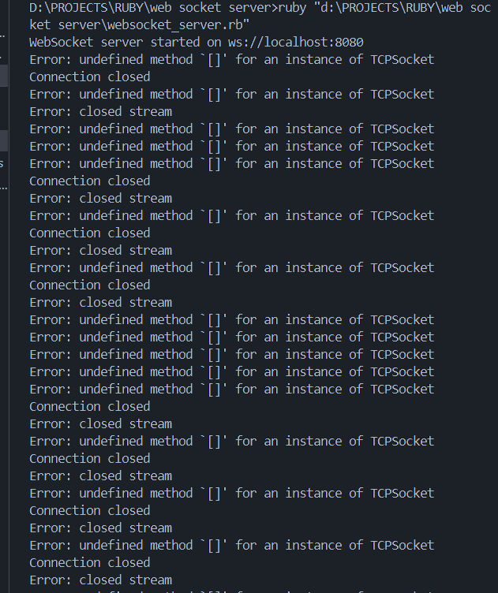

# Web Socket Server

Welcome to the Web Socket Server project! 🚀 This project is designed to provide a robust and efficient WebSocket server using Ruby.

## Features

- 🔌 **Real-time Communication**: Enables real-time data exchange between clients and server.
- 📈 **Scalable**: Easily handles multiple connections simultaneously.
- 🔒 **Secure**: Implements security measures to protect data integrity and privacy.

## Installation

To get started with the Web Socket Server, follow these steps:

1. **Clone the repository**:
   ```sh
   git clone https://github.com/KunjShah95/web-socket-server.git
   ```
2. **Navigate to the project directory**:
   ```sh
   cd web-socket-server
   ```
3. **Install dependencies**:
   ```sh
   bundle install
   ```

## Usage

To start the server, run the following command:

```sh
ruby server.rb
```

## Contributing

We welcome contributions! Please read our [contributing guidelines](CONTRIBUTING.md) before submitting a pull request.

## License

This project is licensed under the MIT License. See the [LICENSE](LICENSE) file for details.

## Output



## Badges


## Contact

For any inquiries, please contact us at [support@example.com](mailto:support@example.com).


